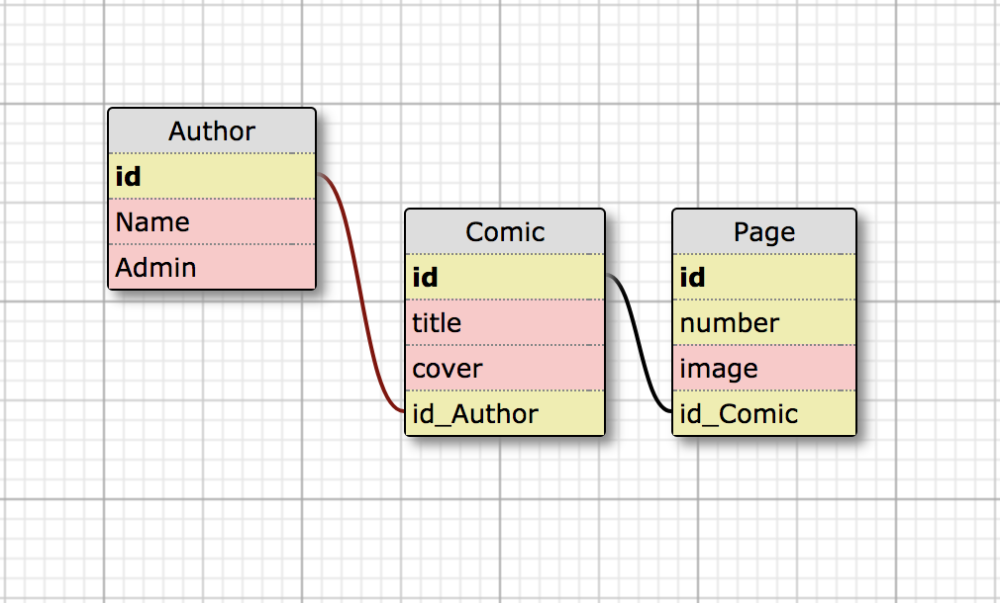

# _Ink About It_

#### _A Web-Comic Publishing Platform_

This project is built on Rails

#### By _Sara Spink_

### Description

_Ink about it is a dedicated web-comics publishing platform. Many people publish their webcomics on Wordpress sites, DeviantArt, and even Reddit. While there are a few publishing platforms already out there, my goal is to create a web application designed for this purpose that is easy to use and which boasts a simple yet attractive user interface._

### Process

I started by sketching out my database schema digitally:

After setting up the database and making sure users could log in, create a Comic and add pages to their project, I worked on getting a uniform style in place:

### User Stories

- A user should be able to create a comic with a title and details
- A user should be able to upload images to their comic and have them display in order
- Each comic should have navigation buttons to start at the beginning, move forward or back one page, or to select a specific page.

### Further Exploration - Stretch Goals

- I want users to be able to leave comments and reviews for other users (a user must be logged in to leave comments)
- Integrate stripe or similar so artists can accept donations or sell prints
- Build an Angular front end

### Technologies Used

* Ruby/Rails
* HTML
* CSS/SCSS
* Bootstrap
* AJAX

### Setup

### Support and contact details

_If you have any updates or suggestions please make a contribution to this repository and/or contact [Sara](spinkbot@gmail.com) directly._

### License

_© 2017 InkAboutIt_
